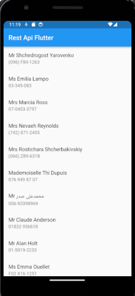

# integrate_api

A new Flutter project.

## Getting Started

This project is a starting point for a Flutter application.

This is a basic project to integrate API with flutter application

In this application, it has separated files between User Interface, Services, and Models

## Screenshot

